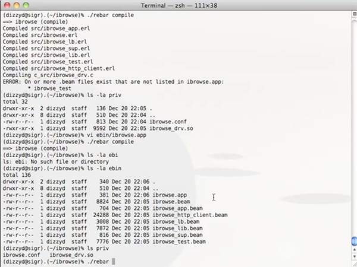

### Riak Screencast – Dave Smith Gives a General Overview of Rebar

**Author** : [Dave Smith](http://www.twitter.com/@dizzyco)

**Date Published** : _December 21, 2009_

**Retrieved From** : [Riak Blog](https://riak.com/posts/technical/dave-smith-gives-a-general-overview-of-rebar/index.html?p=558.html)

**Category** : _Technical Blog_

This video gives a more general overview of Rebar using ibrowse, an existing Erlang application, to show functionality and intended uses.

Enjoy,

