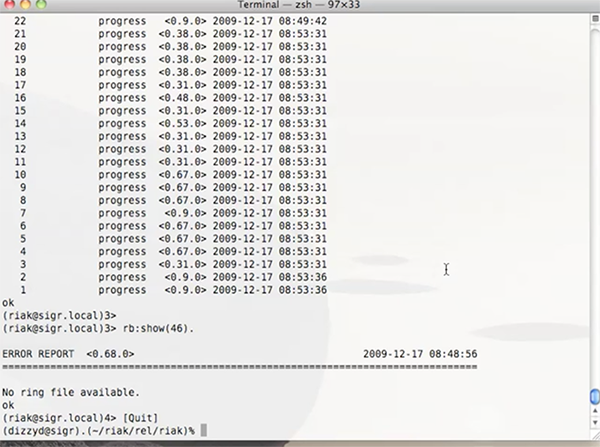

### Riak Screencast – Dave Smith Introduces Riak in an Embedded Node

**Author** : [Dave Smith](http://www.twitter.com/@dizzyco)  

**Date Published** : _December 17, 2009_

**Retrieved From** : [Riak Blog](https://riak.com/posts/technical/basho-screencast-dave-smith-introduces-riak-in-an-embedded-node/index.html?p=5998.html)

**Category** : _Technical Blog_

The team here at Riak has been working hard this past week to take Riak to the next level when it comes to usability in a production environment. The fruits of our labor are demonstrated here in this screencast as we proudly present Riak running in a fully self-contained embedded node environment.

What this means for our users is that it’s easier than ever to deploy and manage Riak servers — mainly no more dependencies on an external Erlang install. What’s more, running a Riak node is controlled by a single script that also provides runtime access to the Erlang console even if Riak is running in the background.

Enjoy, and stay tuned, as there are more of these to come!
